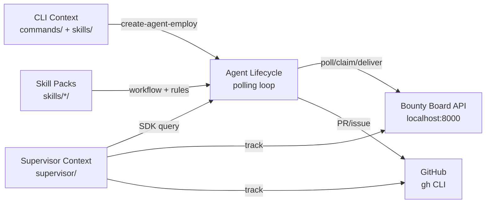
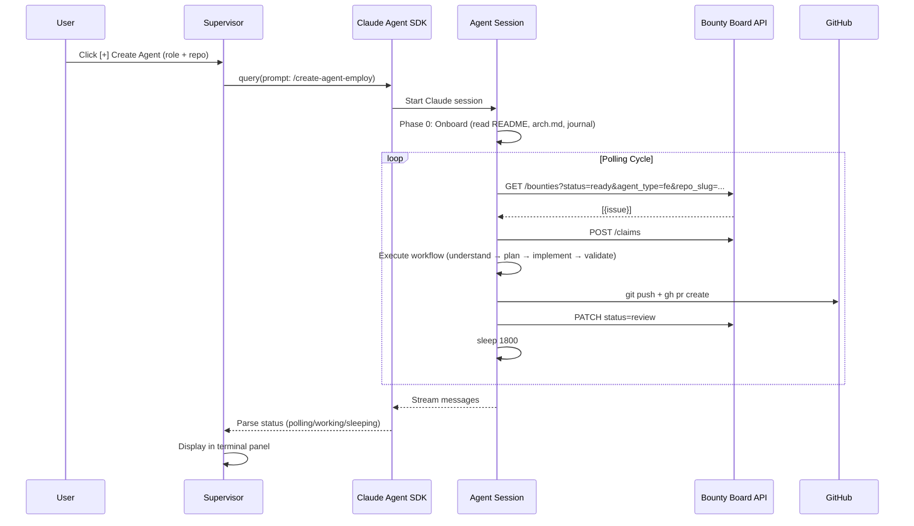

# Architecture — Agent Team

## Domain Model

### Core Domains

- **Agent Lifecycle**: creation, onboarding, polling, execution, delivery, restart, death
- **Skill System**: role-based skill packs (workflow, rules, validate, actions, cases, log)
- **Task Pipeline**: bounty board API → poll → claim → execute → deliver → QA/Design review → merge
- **Supervision**: heartbeat monitoring, stale detection, auto-restart, dashboard UI
- **Tracking**: bounty status, GitHub repo status, PR tracking

### Bounded Contexts



### Aggregate Roots

| Aggregate | Key Entities | Invariants |
|-----------|-------------|------------|
| Agent | AgentState, ManagedAgent, LogEntry | One repo per lifecycle, unique agent_id |
| Skill Pack | SKILL.md, workflow, rules, validate, actions, cases, log | Each role has exactly one skill pack |
| Bounty | Issue, Claim, Status | One claim per issue at a time |
| Supervisor | Electron App, Tray, Dashboard, Tracker | One supervisor instance manages all agents |

## System Architecture

### Tech Stack

| Layer | Technology | Purpose |
|-------|-----------|---------|
| Agent Runtime | Claude Code CLI + Agent SDK | Execute agent sessions |
| Skill Definitions | Markdown + Shell scripts | Workflow, rules, validation |
| Supervisor App | Electron + TypeScript | Dashboard, tray, agent lifecycle |
| Build | esbuild | Bundle TS → JS for Electron |
| Design Tool | Pencil CLI (@pencil.dev/cli) | Canvas design for Design agents |
| Screenshot | Playwright | Visual capture for Design/QA |
| Sync | Bash (sync.sh) | Install to ~/.claude/ |
| External API | Bounty Board (localhost:8000) | Task polling, claiming, status |
| External API | GitHub (gh CLI) | PR, issue, repo operations |

### Component Architecture

```
agent-team/
├── commands/                    ← CLI entry point
│   └── create-agent-employ.md   ← Factory: role + repo → agent loop
├── skills/                      ← 8 skill packs (one per role)
│   └── {role}/
│       ├── SKILL.md             ← Identity + patterns
│       ├── workflow/            ← Phase-gated process
│       ├── rules/               ← Enforceable standards
│       ├── validate/            ← Verification scripts
│       ├── actions/             ← Executable scripts
│       ├── cases/               ← Reference implementations
│       └── log/                 ← Runtime journal entries
├── supervisor/                  ← Electron app
│   ├── src/main/
│   │   ├── index.ts             ← Electron main: window, tray, notifications
│   │   ├── supervisor.ts        ← Agent lifecycle: create, monitor, restart
│   │   ├── tracker.ts           ← Bounty + GitHub status polling
│   │   ├── ipc.ts               ← IPC bridge main ↔ renderer
│   │   └── preload.ts           ← Context bridge for renderer
│   └── renderer/
│       ├── index.html           ← Terminal panel + sidebar UI
│       └── styles.css           ← Dark theme
├── agent-team.config.md         ← User configuration
└── sync.sh                      ← Installation script
```

### Data Flow



## API Contracts

### Bounty Board API (External — localhost:8000)

| Method | Path | Purpose |
|--------|------|---------|
| GET | /repos | List registered repos |
| GET | /repos/{slug} | Get repo details (local_dir) |
| GET | /bounties | List all bounties |
| GET | /bounties?status=ready&agent_type=fe&repo_slug=... | Poll for tasks |
| POST | /bounties | Create new bounty |
| PATCH | /bounties/{slug}/issues/{n} | Update bounty status |
| POST | /claims | Claim a bounty |
| DELETE | /claims/{slug}/issues/{n}?agent_id=... | Release claim |
| GET | /requests?status=pending | Poll for pending requests (ARCH) |
| POST | /requests/{id}/claim | Claim a request (ARCH) |
| PATCH | /requests/{id} | Update request status |

### Supervisor IPC (Internal — Electron)

| Channel | Direction | Purpose |
|---------|-----------|---------|
| create-agent | renderer → main | Spawn new agent (role + repo) |
| stop-agent | renderer → main | Kill agent session |
| restart-agent | renderer → main | Force restart |
| get-agents | renderer → main | List all agent states |
| get-agent-logs | renderer → main | Get log buffer for terminal |
| agent-log | main → renderer | Push real-time log entry |
| agent-status | main → renderer | Push status change |
| get-tracker | renderer → main | Get bounty/repo tracker state |
| set-github-token | renderer → main | Save GitHub token |
| tracker-update | main → renderer | Push tracker refresh |

## User Journey Map

### Primary Flows

1. **Install**: Clone repo → `./sync.sh` → skills copied to ~/.claude/
2. **Manual Agent**: Open terminal → `claude` → `/create-agent-employ` → select role + repo → agent runs
3. **Supervisor**: `npm start` in supervisor/ → Electron app → [+] Create → terminal panel shows agent output
4. **Monitor**: Tray icon shows alive count → Dashboard shows all agents + bounties + repos

### Key Decision Points

| Step | User Decision | System Response |
|------|--------------|-----------------|
| Create agent | Choose role + repo | Load skill pack, onboard, start polling |
| Agent stale | Supervisor detects | Auto-restart if crash, no restart if success |
| Spec conflict | FE/BE feeds back to ARCH | agent_type changed, ARCH re-evaluates |
| PR ready | QA reviews code, Design reviews visual | Merge or reject with feedback |

## Product Roadmap Context

### Current Phase

MVP — core skill packs defined, supervisor functional, basic bounty integration.

### Recent Decisions

- 2026-04-01: Chose .claude/ native structure over plugin — users need to customize skills
- 2026-04-01: Single-repo binding per agent — prevents context pollution
- 2026-04-01: Electron over Docker for supervisor — needs to spawn local Claude sessions
- 2026-04-02: Integrated Pencil CLI for Design canvas — design-first workflow
- 2026-04-02: Added arch.md as ARCH's persistent memory per repo
- 2026-04-02: FE/BE can hand tasks back to ARCH via agent_type change

### Known Tech Debt

| Item | Impact | Priority |
|------|--------|----------|
| Supervisor hardcodes `claude` CLI path via env var | Won't find claude on some systems | Medium |
| No test coverage for supervisor TypeScript | Regressions on every change | High |
| DevTools auto-opens in supervisor | Should be dev-only | Low |
| sync.sh overwrites skill customizations | Users lose edits on re-sync | Medium |
| No log rotation for agent journals | Disk fills up over time | Low |
| Bounty Board API assumed at localhost:8000 | Not configurable per-agent | Low (config exists) |

### Planned Features

| Feature | Domain Impact | Dependencies |
|---------|--------------|-------------|
| OPS/DEBUG/PM skill depth | Parity with FE/Design/ARCH | None |
| Agent cost tracking in dashboard | Supervisor + renderer | SDK ResultMessage parsing (exists) |
| Journal viewer in sidebar | Supervisor renderer | Read from ~/.agent-team/journal/ |
| Multi-machine agent coordination | New distributed context | Network transport for heartbeats |
| Skill marketplace | New distribution context | Package format, registry |

## Failure Modes

| Component | Failure | Detection | Recovery | User Impact |
|-----------|---------|-----------|----------|-------------|
| Claude session | Rate limited | SDK rate_limit_event | Wait + retry (agent sleeps) | Agent pauses |
| Claude session | Crash/OOM | SDK stream ends | Auto-restart if cycle > 0 | Brief downtime |
| Claude session | Budget exceeded | SDK error_max_budget | No restart (prevents cost spiral) | Agent stops |
| Bounty Board API | Unreachable | curl fails | Agent sleeps, retries next cycle | No tasks polled |
| GitHub | Auth failure | gh CLI error | Agent logs error, continues | No PR created |
| Pencil CLI | Not authenticated | pencil status check | Skip design phase, fall back to code-direct | No canvas design |
| Supervisor | Electron crash | Process exits | User relaunches app | Agents continue (they're separate processes) |
