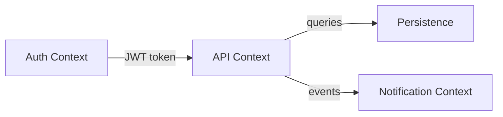
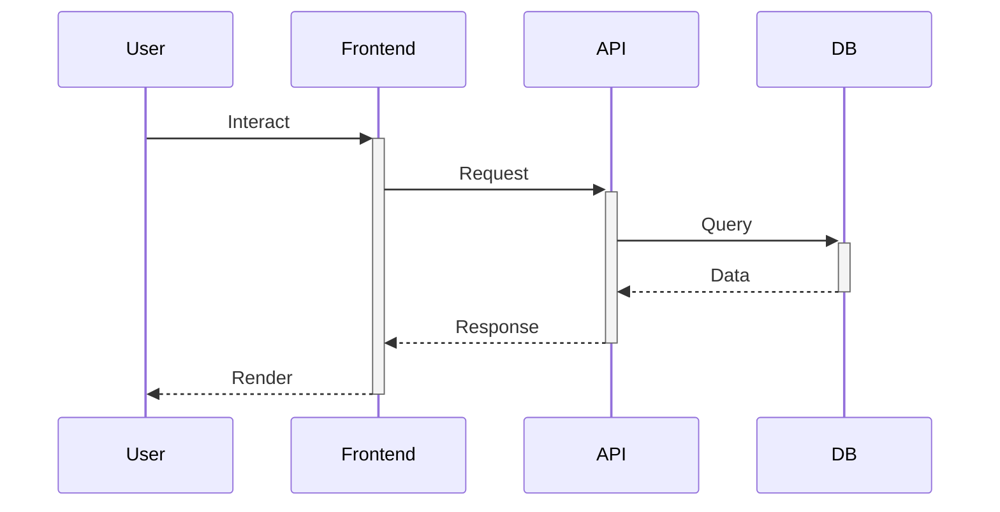

# Case: arch.md Template

Every repo should have an `arch.md` at root. ARCH agent reads it on onboarding and maintains it over time. This is ARCH's persistent memory for the repo.

---

## Template

```markdown
# Architecture — {Project Name}

## Domain Model

### Core Domains
- **{Domain A}**: {description, key entities}
- **{Domain B}**: {description, key entities}

### Bounded Contexts


### Aggregate Roots
| Aggregate | Key Entities | Invariants |
|-----------|-------------|------------|
| User | User, Profile, Preferences | Email unique, one active session |
| Theme | ThemeConfig, Preset, CustomTheme | Valid CSS values, max 50 custom themes |

## System Architecture

### Tech Stack
| Layer | Technology | Version |
|-------|-----------|---------|
| Frontend | Next.js (App Router) | 15.x |
| Styling | Tailwind CSS | 4.x |
| Backend | Next.js API Routes | — |
| Database | Prisma + SQLite | — |
| Auth | NextAuth.js | — |

### Data Flow


### Folder Structure
```
src/
  app/          ← Pages (App Router)
  components/   ← UI components
  lib/          ← Business logic, API client
  types/        ← Shared types
```

## API Contracts

### Existing Endpoints
| Method | Path | Purpose | Auth |
|--------|------|---------|------|
| GET | /api/users | List users | Yes |
| POST | /api/themes | Create theme | Yes |

## User Journey Map

### Primary Flows
1. **Onboarding**: Landing → Sign Up → Setup → Dashboard
2. **Daily Use**: Login → Dashboard → {Core Feature} → Settings
3. **Admin**: Login → Admin Panel → User Mgmt → Config

### Key Decision Points
| Step | User Decision | System Response |
|------|--------------|-----------------|
| Theme selection | Pick preset or custom | Apply CSS vars, save to DB |
| Export | Download or share | Generate config file |

## Product Roadmap Context

### Current Phase
{MVP / Growth / Maturity}

### Recent Decisions
- 2026-03-21: Chose shadcn/ui over Radix raw — faster dev, good defaults
- 2026-03-25: Dual theme support — users need light+dark in one config

### Known Tech Debt
| Item | Impact | Priority |
|------|--------|----------|
| No test coverage for theme editor | Regressions on every change | High |
| Hardcoded API base URL | Can't deploy to staging | Medium |

### Planned Features (from product roadmap)
| Feature | Domain Impact | Dependencies |
|---------|--------------|-------------|
| Multi-tenant support | New Tenant aggregate, auth changes | DB migration |
| Theme marketplace | New Commerce context | Payment provider |

## Failure Modes

| Service Boundary | Failure | Detection | Recovery | User Impact |
|-----------------|---------|-----------|----------|-------------|
| DB | Connection lost | Health check | Reconnect, 3 retries | 503 page |
| Auth | Token expired | 401 response | Redirect to login | Session lost |
```

---

## How ARCH Uses arch.md

1. **Onboarding**: Read arch.md first — this is your map of the system
2. **Before decomposing**: Check domain model — does the request touch existing domains or create new ones?
3. **After decomposing**: Update arch.md if you introduced new domains, APIs, or changed the data flow
4. **After re-evaluation**: Update Known Tech Debt or Recent Decisions if feedback revealed new constraints
